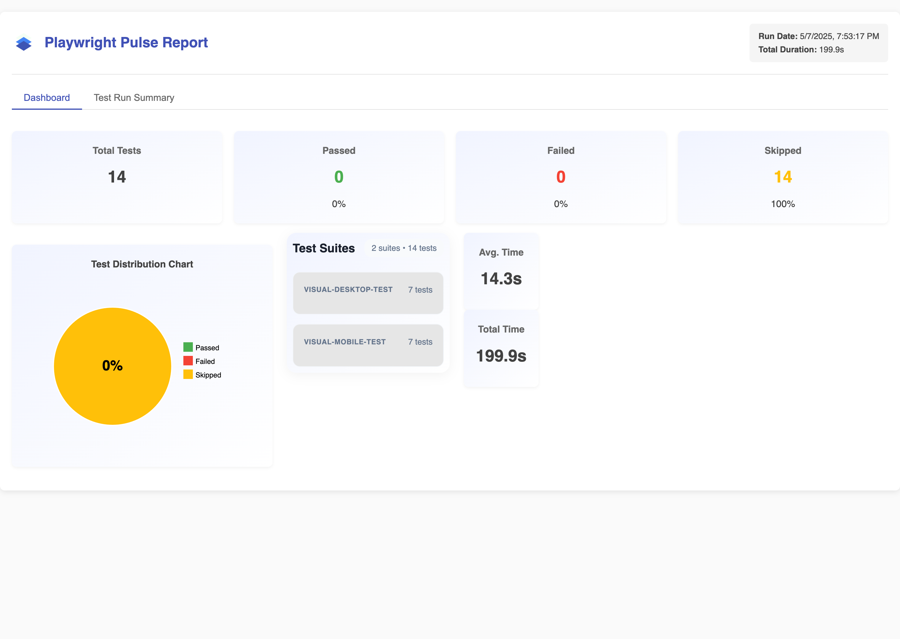

# Playwright Pluse Report

  
*A powerful custom Playwright reporter with interactive dashboard and standalone HTML reports, now with sharding support!*

<a href="https://pulse-report.netlify.app/" target="_blank"><h3>Live Demo</h3></a>

## 🌟 Features

- **Custom Playwright Reporter** - Collects detailed test results with rich metadata
- **Sharding Support** - Seamlessly handles parallel test execution across shards
- **Two Reporting Options**:
  - **Standalone HTML Report** - Self-contained, shareable single file
  - **Email Report** - Attached test summary with generated test report
- **CI/CD Ready** - GitHub Actions workflow examples included
- **Email Integration** - Send reports directly to stakeholders
- **AI Analysis** - Get insights into your test results

## 📸 Screenshots

### 🖥️ Desktop View

<div align="center" style="display: flex; gap: 20px; justify-content: center; flex-wrap: wrap;"> <a href="https://postimg.cc/180cym6c" target="_blank">  <p align="center"><strong>Dashboard Overview</strong></p> </a> <a href="https://postimg.cc/V5TFRHmM" target="_blank">  <p align="center"><strong>Test Details</strong></p> </a> <a href="https://postimg.cc/XXTwFGkk" target="_blank">  <p align="center"><strong>Filter View</strong></p> </a> </div>

### 📱 Mobile View

<div align="center" style="display: flex; gap: 20px; justify-content: center; flex-wrap: wrap;">

  <a href="https://postimg.cc/CzJBLR5N" target="_blank">
    
    <p align="center"><strong>Dashboard Overview</strong></p>
  </a>

  <a href="https://postimg.cc/G8YTczT8" target="_blank">
    
    <p align="center"><strong>Test Details</strong></p>
  </a>

</div>

### Email Report Example

[](https://postimg.cc/DmCPgtqh)

## 🛠️ How It Works

1. **Reporter Collection**:
   - Custom reporter collects detailed results during test execution
   - Handles sharding by merging `.pulse-shard-results-*.json` files

2. **JSON Output**:
   - Generates comprehensive `playwright-pulse-report.json`

3. **Visualization Options**:
   - **Static HTML**: Self-contained report file with all data
   - **Email**: Send formatted reports to stakeholders

## 🏁 Quick Start

### 1. Installation

```bash
npm install @arghajit/playwright-pulse-reporter@latest --save-dev
# or
yarn add @arghajit/playwright-pulse-reporter@latest --dev
# or
pnpm add @arghajit/playwright-pulse-reporter@latest --save-dev
```

### 2. Configure Playwright

```typescript
// playwright.config.ts
import { defineConfig } from '@playwright/test';
import * as path from 'path';


const PULSE_REPORT_DIR = path.resolve(__dirname, 'pulse-report');

export default defineConfig({
  reporter: [
    ['list'],
    ['@arghajit/playwright-pulse-reporter', {
      outputDir: PULSE_REPORT_DIR
    }]
  ],
  // Other configurations...
});
```

### 3. Generate Reports

After running tests:

```bash
npx generate-pulse-report  # Generates static HTML
npx send-email            # Sends email report
```

## 📊 Report Options

### Option 1: Static HTML Report

```bash
npx generate-pulse-report
```

- Generates `playwright-pulse-static-report.html`
- Self-contained, no server required
- Preserves all dashboard functionality

### Option 2: Email Report

1. Configure `.env`:

   ```bash
   SENDER_EMAIL_1=recipient1@example.com
   SENDER_EMAIL_2=recipient2@example.com
   # ... up to 5 recipients
   ```

2. Send report:

   ```bash
   npx send-email
   ```

## 🤖 AI Analysis

The dashboard includes AI-powered test analysis that provides:

- Test flakiness detection
- Performance bottlenecks
- Failure pattern recognition
- Suggested optimizations

## ⚙️ CI/CD Integration

### Basic Workflow

```yaml
# Upload Pulse report from each shard (per matrix.config.type)
- name: Upload Pulse Report results
  if: success() || failure()
  uses: actions/upload-artifact@v4
  with:
    name: pulse-report
    path: pulse-report/

# Download all pulse-report-* artifacts after all shards complete
- name: Download Pulse Report artifacts
  uses: actions/download-artifact@v4
  with:
    pattern: pulse-report
    path: downloaded-artifacts

# Merge all sharded JSON reports into one final output
- name: Generate Pulse Report
  run: |
    npm run script merge-report
    npm run script generate-report

# Upload final merged report as CI artifact
- name: Upload Pulse report
  uses: actions/upload-artifact@v4
  with:
    name: pulse-report
```

### Sharded Workflow

```yaml
# Upload Pulse report from each shard (per matrix.config.type)
- name: Upload Pulse Report results
  if: success() || failure()
  uses: actions/upload-artifact@v4
  with:
    name: pulse-report-${{ matrix.config.type }}
    path: pulse-report/

# Download all pulse-report-* artifacts after all shards complete
- name: Download Pulse Report artifacts
  uses: actions/download-artifact@v4
  with:
    pattern: pulse-report-*
    path: downloaded-artifacts

# Organize reports into a single folder and rename for merging
- name: Organize Pulse Report
  run: |
    mkdir -p pulse-report
    for dir in downloaded-artifacts/pulse-report-*; do
      config_type=$(basename "$dir" | sed 's/pulse-report-//')
      cp -r "$dir/attachments" "pulse-report/attachments"
      cp "$dir/playwright-pulse-report.json" "pulse-report/playwright-pulse-report-${config_type}.json"
    done

# Merge all sharded JSON reports into one final output
- name: Generate Pulse Report
  run: |
    npm run script merge-report
    npm run script generate-report

# Upload final merged report as CI artifact
- name: Upload Pulse report
  uses: actions/upload-artifact@v4
  with:
    name: pulse-report
    path: pulse-report/

```

## 🧠 Notes

- Each shard generates its own playwright-pulse-report.json inside pulse-report/.
- Artifacts are named using the shard type (matrix.config.type).
- After the test matrix completes, reports are downloaded, renamed, and merged.
- merge-report is a custom Node.js script that combines all JSON files into one.
- generate-report can build a static HTML dashboard if needed.

## 📂 Key Files

```bash
playwright-pulse-reporter/
├── src/
│   ├── reporter/            # Reporter implementation
│   └── app/                 # Next.js dashboard
├── scripts/
│   └── generate-static-report.mjs  # HTML generator
|   └── merge-pulse-report.mjs  # merge sharded reports
|   └── sendReport.mjs  # Send email report
├── pulse-report/            # Generated reports
└── sample-report.json       # Example data
```

## 📬 Support

For issues or feature requests, please [Contact Me](mailto:arghajitsingha47@gmail.com).

---

<div align="center">Made by Arghajit Singha | MIT Licensed</div>
