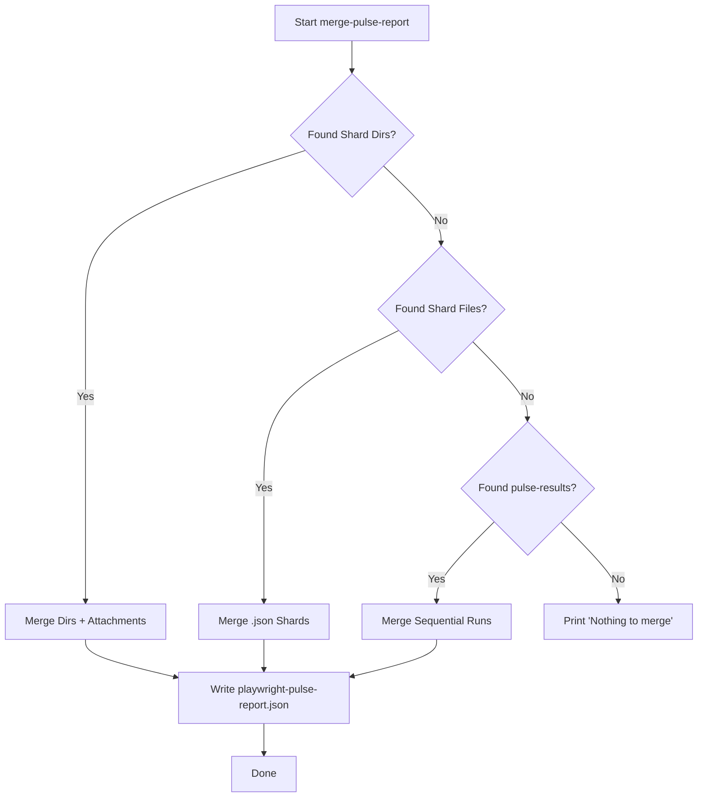

# Sharding & Merging

The `merge-pulse-report` command is a powerful utility designed to consolidate test results from distributed or sequential runs into a single, comprehensive report.

Here is a deep dive into how it works, covering the three main scenarios it handles.

---

## 1. The Strategy: "Waterfall" Discovery

When you run `merge-pulse-report`, it doesn't just look for one thing. It follows a "waterfall" logic to find data in the following order:

1. **Directory-based Shards** (Common in CI like GitHub Actions Matrix).
2. **File-based Shards** (Common with `pytest-xdist` on a single machine).
3. **Sequential Runs** (When `resetOnEachRun=False` is used).

---

### 2. Scenario A: Sharded Directories (`merge_shard_directories`)

This is used when you have multiple folders (e.g., `pulse-report-1`, `pulse-report-2`) collected from different CI nodes.

- **Discovery**: It scans your main output directory for sub-folders. It identifies a "shard folder" if it contains a `playwright-pulse-report.json` **OR** any shard files (like `pulse-shard-results-0.json`).
- **Deep Merge (New Resilience)**: If it finds a folder that _only_ contains raw shard files (common if a worker crashed or didn't finish its own local merge), it first runs a "local merge" inside that sub-folder to create a valid JSON report.
- **Attachment Consolidation**: It recursively copies all screenshots, videos, and traces from the `attachments/` sub-folders of every shard into a single global `attachments/` folder.
- **Cleanup**: Once merged, it deletes the individual shard folders to keep your workspace clean (unless `--no-cleanup` is passed).

---

### 3. Scenario B: Shard Files (`merge_shard_files`)

This is the standard mode for `pytest-xdist`. Each worker process writes its own temporary file: `pulse-shard-results-X.json`.

- **Hidden File Support**: It looks for files starting with `pulse-shard-results-` **and** hidden files starting with `.pulse-shard-results-`.
- **Sorting**: It sorts them by name to ensure consistent merging.
- **Consolidation**: It reads all JSON chunks and combines them into the final `playwright-pulse-report.json`.

---

### 4. Scenario C: Sequential Runs (`merge_sequential_reports`)

If you run tests multiple times with `pulse_reset_on_each_run = False` in your `pytest.ini`, the plugin saves every single run as a timestamped file in `pulse-report/pulse-results/`.

- **Timeline Merge**: This function scans that directory, sorts the files by their creation time, and merges them so you can see the history of multiple runs in one dashboard.

---

### 5. How the Data is Actually Combined (`_merge_report_list`)

This is the "brain" of the merge operation. It doesn't just append text; it performs a structural merge of the JSON objects:

- **Statistics**: It sums up `totalTests`, `passed`, `failed`, `skipped`, and `flaky` counts across all reports.
- **Duration**: It sums the total execution time.
- **Environment**: It collects environment details (OS, Python version, etc.) from all shards into a list so you can see if different workers ran on different setups.
- **Results**: It flattens the `results` array, combining every single test case from every shard into one master list.
- **Metadata**: It updates the `generatedAt` timestamp to the current time and ensures the `runId` is unique for the new merged report.

### Summary Flowchart

By handling all these layers, the command ensures that no matter how complex your CI pipeline is, you always end up with a single source of truth for your test results.
